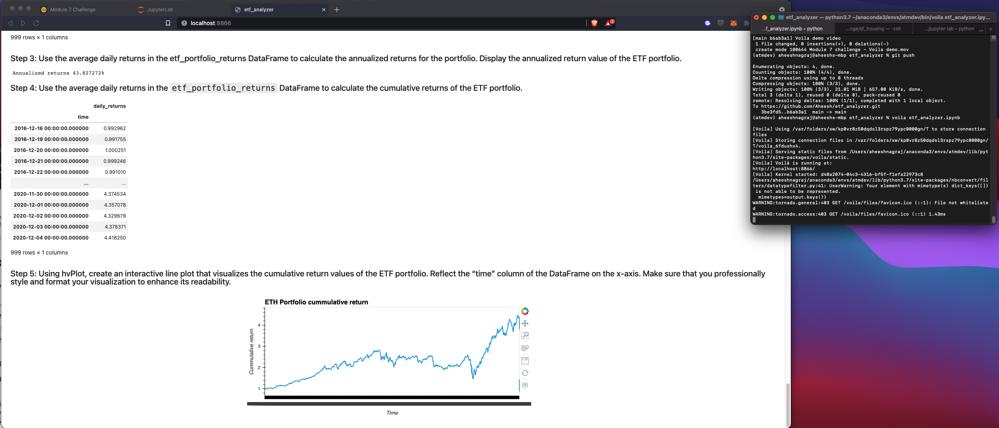

# ETF Analyzer

This jupyter lab based notebook application analyzes the ETF portfolio and plots the visualization.

---

## Technologies

This project leverages python Hvplot visualization and Voilà library to deploy the notebook as a web application.

---

## Usage

To run the application from CLI run voila <Notebookname>.

This will start the application and run on a default browser. 
Check out the demo video here :]
    
    
---

## Contributors

Application built by Aheesh. Reach me via twitter @aheesh.

---

## License

MIT